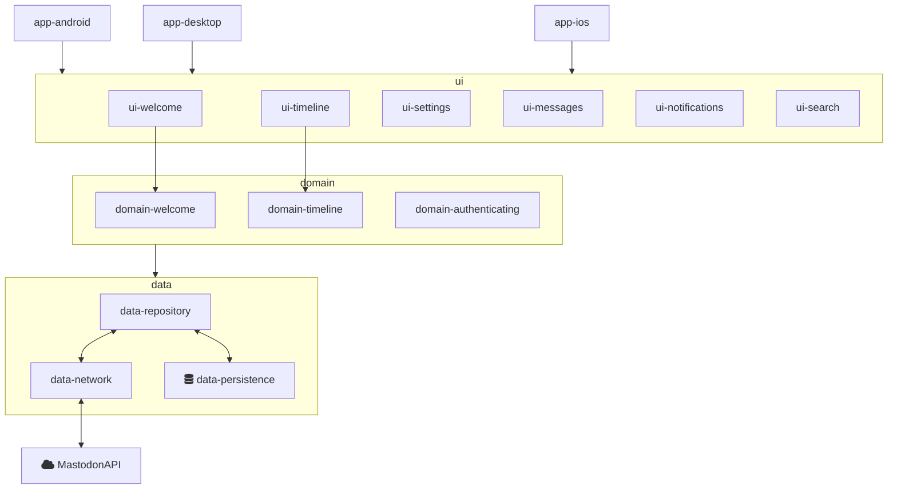

# Welcome to MastodonCompose[^temporary]
[^temporary]: This is just the working title for now.

This is a free and open Mastodon client and lives from contributions of the community. 

There are many ways to contribute:

 * 📣 Spread the project or its apps to the world
 * ✍️ Writing tutorials and blog posts
 * 📝 Create or update [the documentation](https://github.com/AndroidDev-social/MastodonCompose/wiki)
 * 🐛 Submit [bug reports](https://github.com/AndroidDev-social/MastodonCompose/issues)
 * 💡 Adding ideas and feature requests to [Discussions](https://github.com/AndroidDev-social/MastodonCompose/discussions)
 * 👩‍🎨 Create designs or UX flows
 * 🧑‍💻 Contribute code or review PRs


## 📜 Ground Rules

A community like this should be **open**, **considerate** and **respectful**.

Behaviours that reinforce these values contribute to a positive environment, and include:

 * **Being open**. Members of the community are open to collaboration, whether it's on PEPs, patches, problems, or otherwise.
 * **Focusing on what is best for the community**. We're respectful of the processes set forth in the community, and we work within them.
 * **Acknowledging time and effort**. We're respectful of the volunteer efforts that permeate the Python community. We're thoughtful when addressing the efforts of others, keeping in mind that often times the labor was completed simply for the good of the community.
 * **Being respectful of differing viewpoints and experiences**. We're receptive to constructive comments and criticism, as the experiences and skill sets of other members contribute to the whole of our efforts.
 * **Showing empathy towards other community members**. We're attentive in our communications, whether in person or online, and we're tactful when approaching differing views.
 * **Being considerate**. Members of the community are considerate of their peers -- other Python users.
 * **Being respectful**. We're respectful of others, their positions, their skills, their commitments, and their efforts.
 * **Gracefully accepting constructive criticism**. When we disagree, we are courteous in raising our issues.
 * **Using welcoming and inclusive language**. We're accepting of all who wish to take part in our activities, fostering an environment where anyone can participate and everyone can make a difference.


## 🤝 Responsibilities

 * **Ensure cross-platform compatibility** for every change that's accepted. Windows, Mac, Debian & Ubuntu Linux.
 * **Ensure that code** that goes into the repository **meets all requirements**
 * **Create issues for any major changes** and enhancements that you wish to make. Discuss things transparently and get community feedback.
 * **Don't add** any classes to the codebase **unless absolutely needed**. Err on the side of using functions.
 * Be welcoming to newcomers and encourage diverse new contributors from all backgrounds.


## 🧑‍💻 Code Contribution

To contribute code to the repository, you don't need any permissions.
First start by forking the repository, clone and checkout your clone and start coding.
When you're happy with your changes, create Atomic commits on a **new feature branch** and push it to ***your*** fork.

Atomic commits will make it easier to track down regressions. Also, it enables the ability to cherry-pick or revert a change if needed.

1. Fork it (https://github.com/AndroidDev-social/MastodonCompose/fork)
2. Install pre-commit hooks (`git config core.hooksPath .githooks`)
3. Create a new feature branch (`git checkout -b feature/fooBar`)
4. Commit your changes (`git commit -am 'Add some fooBar'`)
5. Push to the branch (`git push origin feature/fooBar`)
6. Create a new Pull Request


## 🐛 How to report a bug

> If you find a security vulnerability, do NOT open an issue. Email [webmaster@stuermer-benjamin.de] instead.

1. Open the [issues tab](https://github.com/AndroidDev-social/MastodonCompose/issues) on github
2. Click on [New issue](https://github.com/AndroidDev-social/MastodonCompose/issues/new/choose)
3. Choose the bug report 🐛 template and fill out all required fields


## 💡 How to suggest a feature or enhancement

Check [open issues](https://github.com/AndroidDev-social/MastodonCompose/issues) and [ongoing discussions](https://github.com/AndroidDev-social/MastodonCompose/discussions) for a list of proposed features.

If your suggestion can not be found already, see if it is already covered by our [Roadmap](https://github.com/AndroidDev-social/MastodonCompose#roadmap).

Otherwise, start a new [Discussion](https://github.com/AndroidDev-social/MastodonCompose/discussions) and see what other users and contributors think.


## 📟 Communication

There is also a [Slack to join](https://join.slack.com/t/androiddev-social/shared_invite/zt-1jchjo9kz-_Q_I02QWeenpya10Is6trQ) to get in touch with the community.

Also, sometimes it makes it easier to discuss topics


## 💾 Technology

The project is currently build based on the [Compose Multiplatform](https://www.jetbrains.com/lp/compose-mpp/) port from jetbrains,
to re-use different parts on multiple platforms supporting Android, iOS and Desktop.

Underneath it is using these frameworks:

* [Ktor](https://github.com/ktorio/ktor) - Kotlin async web framework
* [SQLDelight](https://cashapp.github.io/sqldelight/multiplatform_sqlite/) - For SQL statements


## 🗄️ Structure

The project is structured in **features and layers**




## 💻 Build

To build the different apps, checkout the repository and run one of the following commands on your local machine

To build and run the desktop app
```shell
$ ./gradlew :app-desktop:run
```

To build and run the android app (emulator or real android device is needed)
```shell
$ ./gradlew :app-android:installDebug
```
