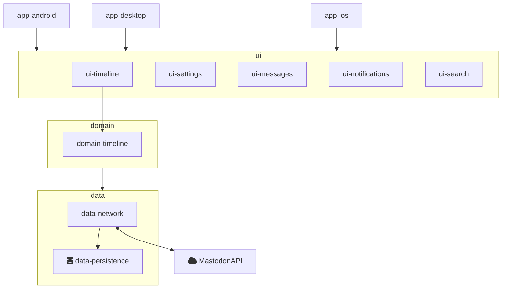

# Mastodon compose client
[](https://creativecommons.org/licenses/by-nd/4.0)


A multiplatform Mastodon client written in [Kotlin](kotlinlang.org) for the amazing [androiddev.social](https://androiddev.social) community and everyone else who enjoys #Fediverse

[F-Droid]
[Google Play]
[Apple Appstore]


## Table of contents

* [Getting started](#getting-started)
* [Contribution](#contribution)
* [License](#license)


## Getting started

The app is not published nor ready for use. Later on it will probably just be installed from any of the available sources.


## Development

This project has just started recently 🚀
**Everything** is open to discussion and the code is only reflecting a MVP approach.


### Technology

The project is currently build based on the [Compose Multiplatform](https://www.jetbrains.com/lp/compose-mpp/) port from jetbrains, to re-use different parts on multiple platforms supporting Android, iOS and Desktop.

Underneath it is using

 * [Ktor](https://github.com/ktorio/ktor) - Kotlin async web framework
 * [SQLDelight](https://cashapp.github.io/sqldelight/multiplatform_sqlite/) - To write SQL statements


### Structure

The project is structured in **features and layers**




## Roadmap

See the [open issues] for a list of proposed features (and known issues).

 * Building a MVP with base functionality
   * Sign up flow (for new users withoug account)
   * Select an instance [joinmastodon servers](https://joinmastodon.org/de/servers)
   * Sign in
   * Browse timeline


## Build

To build the different apps, checkout the repository and run one of the following commands on your local machine

To build and run the desktop app
```shell
$ ./gradlew :app-desktop:run
```

To build and run the android app (emulator or real android device is needed)
```shell
$ ./gradlew :app-android:installDebug
```


## Contributing

If you want to contribute by adding a feature or bugfix, follow the steps below.
Keep in mind to create Atomic commits to make it easier to track down regressions.
This also enables the ability to revert or cherry pick a change to different branches.
Finally a small PR attracks more people to do a code review.


1. Fork it (https://github.com/AndroidDev-social/MastodonCompose/fork)
2. Create a new feature branch (`git checkout -b feature/fooBar`)
3. Commit your changes (`git commit -am 'Add some fooBar'`)
4. Push to the branch (`git push origin feature/fooBar`)
5. Create a new Pull Request


## License
Some community friendly license, not decided which one :)
